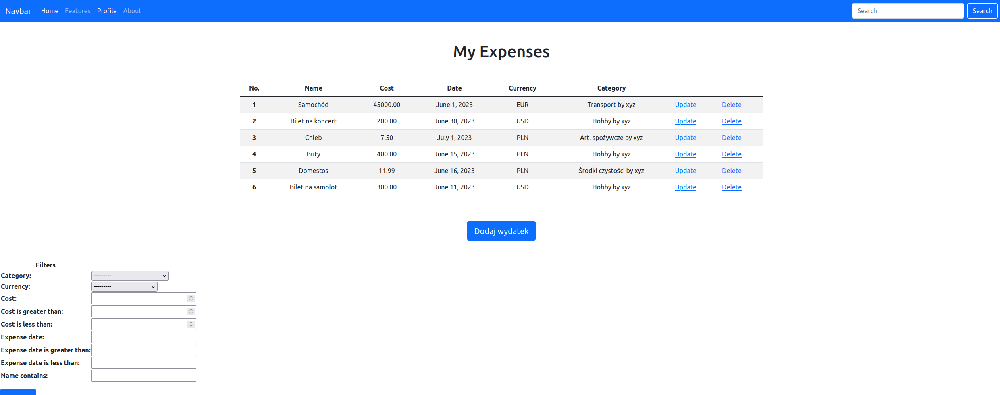
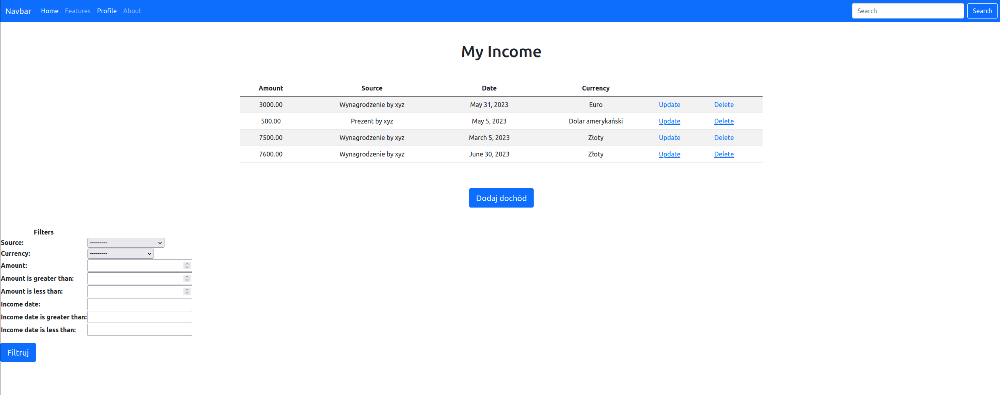
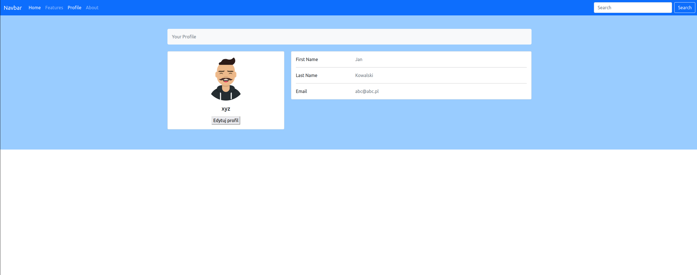

# KnowYourMoney
This is an application to control your home budget. It allows user to add income and expenses and creates a balance.

# Getting started
1. To run this application you need to have installed Python. If you don't have it already, please visit 
    Python.org to download it.

2. Download 
     
   - You need to clone repository to your local destination
   
           $ cd path/to/your/workspace
   
           git clone https://github.com/ITFutureManiacs/KnowYourMoney.git

3. Requirements
   - Once your virtual environment is activated and project is cloned you need to install requirements:
                
           $ pip install -r requirements.txt

# Usage
- To use this application you need to type (if you're in your workspace directory):
        
        python manage.py runserver
    or 

        python3 manage.py runserver
- After that you need to create an account to start using app.

- Main functionalities:
  - Income and expenses balance
  - Income view
  - Expenses view
  - User registration/login
  - Updating user profile
  - Password change

- To do:
  - Adding income in different currencies
  - Adding expenses in different currencies
  - Filtering list of expenses
  - Filtering list of income
  - Adding categories of expenses
  - Adding sources of income

- Technologies used:
  - Python 3.10.6
  - Django == 4.2.2
  - HTML
  - Bootstrap
# How does it look like:

